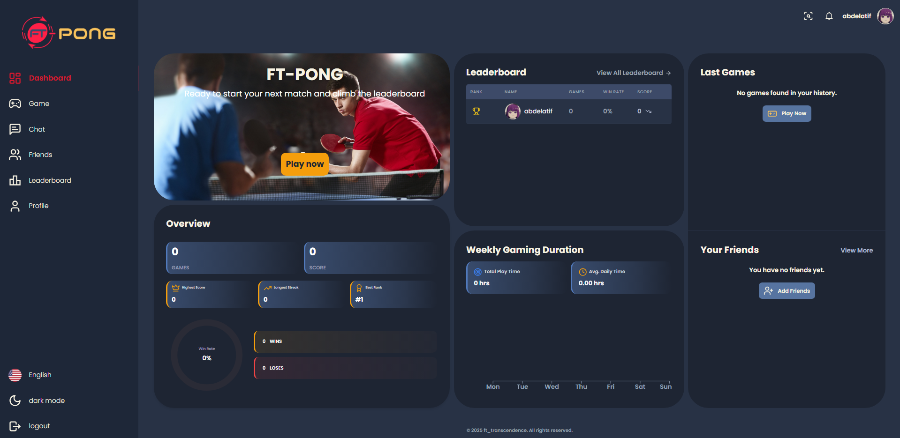

---
# ft_transcendence

# Project setup documentation (for development)
https://crimson-sapphire-6bd.notion.site/Project-setup-40737f3cd2b64b72a82e53d94a036527

### Table of Contents
1. [Overview](#overview)
2. [Features](#features)
3. [Tech Stack](#tech-stack)
4. [Setup and Installation](#setup-and-installation)
5. [Usage](#usage)
6. [API Documentation](#api-documentation)
7. [ELK Stack](#elk-stack)
8. [Nginx Setup](#nginx-setup)
9. [License](#license)


### Overview
A web-based multiplayer Pong game built with a React frontend and a Django backend. Players can compete against each other in real-time, chat, and enjoy various game modes.

The application is live at: [https://ft-pong.me/](https://ft-pong.me/)

### Features
- **User Authentication**: Secure login and registration system.
- **Real-Time Gameplay**: Smooth and responsive multiplayer game experience.
- **Chat System**: In-game chat for players to communicate.
- **Game Modes**: Local play, remote play with friends, and tournaments.

### Tech Stack
- **Frontend**: React, TypeScript, Vite
- **Backend**: Django, Django REST Framework
- **Database**: PostgreSQL
- **Others**: Docker, Docker Compose, Makefile (for easy setup)
- **ELK Stack**: Elasticsearch, Logstash, Kibana (for logging and monitoring)
- **Nginx**: For SSL termination and reverse proxy

### Setup and Installation
1. Clone the repository:
   ```bash
   git clone https://github.com/0x00-A/ft_transcendence.git
   cd ft_transcendence
   ```
2. Create a `.env` file in the root directory of the project and populate it with the necessary environment variables. You can refer to `.env.example` for the required variables.
3. Run the project using the `make` command:
   ```bash
   make
   ```
   This command sets up the entire development environment with Docker Compose, starting both the frontend and backend services.

### Usage
- Access the application through Nginx at `https://localhost`. Nginx will serve the frontend React app by default.
- Kibana's interface is available at `/kibana` (e.g., `https://localhost/kibana`).

### API Documentation
The project uses Swagger for API documentation, which can be accessed at:
```
https://localhost/api/docs/
```

### ELK Stack
The project integrates the **ELK Stack** (Elasticsearch, Logstash, and Kibana) for logging and monitoring purposes. The logs are captured and can be analyzed using Kibana's user-friendly interface. This setup helps track the application's performance and debug any issues that arise.

### Nginx Setup
Nginx is used as a reverse proxy and for SSL termination in the project. It serves the React build and routes specific requests:
- Routes frontend requests to the React app.
- Routes API requests (`/api/*`) to the Django backend.
- Routes WebSocket connections (`/ws/*`) to the Django backend.
- Routes requests to Kibana at `/kibana`.

This ensures that all communication between the client and server is handled securely, with Nginx managing routing and SSL termination.

### Contributors
This project was a team effort, and I want to acknowledge the hard work and dedication of my team members:

- **0x00-A**: [GitHub Profile](https://github.com/0x00-A)  
- **mhidoxox**: [GitHub Profile](https://github.com/mhidoxox)  
- **rel-isma**: [GitHub Profile](https://github.com/rel-isma)

Their contributions were vital to the success of the project, and I am grateful for their hard work and collaboration.

### License
This project is licensed under the MIT License.

---
